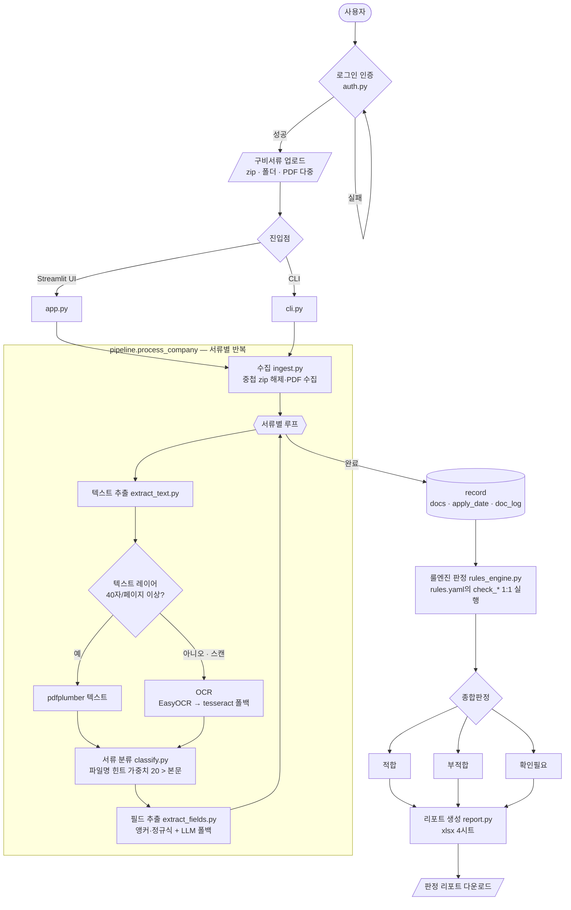

# 창업·벤처 녹색융합클러스터 — 입주 신청서류 적합 검토기 (MVP)

기업별 구비서류(zip/PDF)를 넣으면 **모집공고·운영규정·관리지침의 판단기준**에 따라
신청요건 적합 여부를 자동 검토하고, 근거가 달린 **판정 리포트(xlsx)**를 만든다.

판정 흐름: `구비서류 → (중첩 zip 해제) → 서류 분류 → 하이브리드 텍스트 추출(텍스트레이어/OCR)
→ 필드 추출 → 룰엔진 판정 → 리포트`

## 서비스 흐름도



판정값은 **적합 / 부적합 / 확인필요 / 해당없음**이며, 하나라도 `부적합`이면 종합 `부적합`,
없으면 `확인필요`가 하나라도 있으면 `확인필요`, 모두 통과 시 `적합`. 모든 결과에 근거(evidence)가 기록된다.

## 1. 설치

의존성·가상환경은 **uv**로 관리한다(`pyproject.toml` + `uv.lock`).
```bash
uv sync                  # .venv 생성 + 의존성 설치 + 패키지 editable 설치
uv sync --extra docling  # (선택) 표/레이아웃 복원(Docling)까지
```
uv가 없으면 `pip install -r requirements.txt`도 유지된다(보조 경로).

스캔 PDF용 한글 OCR은 **EasyOCR**가 기본 엔진이다(`requirements.txt`에 포함, 한글·영어 내장,
CPU 동작, 최초 1회 모델 자동 다운로드 후 오프라인). 별도 설치는 필요 없다.

PDF 래스터화에 `poppler`가 있으면 더 안정적이며, 없으면 PyMuPDF로 폴백한다(선택).
tesseract는 EasyOCR 미설치 시의 폴백일 뿐 기본 경로가 아니다.
```bash
#  (선택) tesseract 폴백 사용 시 — Ubuntu:  sudo apt-get install tesseract-ocr tesseract-ocr-kor poppler-utils
#                                  macOS :  brew install tesseract tesseract-lang poppler
```

## 2. 실행

### 로그인 계정 만들기 (UI 최초 1회 필수)
Streamlit UI는 로그인 게이트로 보호된다. 등록된 사용자가 없으면 진입할 수 없으니 먼저 계정을 만든다.
```bash
uv run python -m cluster_screening.auth add <아이디>     # 비밀번호는 안전 입력(가림)
uv run python -m cluster_screening.auth list             # 계정 목록
uv run python -m cluster_screening.auth delete <아이디>  # 계정 삭제
```
비밀번호는 평문 저장하지 않고 PBKDF2-HMAC-SHA256 해시로 `users.json`에 저장된다(`users.json`은 git 비추적).
CLI(`cluster_screening.cli`)는 로그인 없이 동작한다.

### Streamlit UI
```bash
uv run streamlit run src/cluster_screening/app.py
```
로그인 후 사이드바에서 기업명·신청일·zip 비밀번호를 넣고, 구비서류(zip 또는 PDF 여러 개)를 업로드 → "검토 실행".

### CLI
```bash
uv run cluster-screening <폴더|zip|pdf> --name 기업명 --apply 2026-03-16 --pw 비밀번호 --out 판정결과.xlsx
# 또는:  uv run python -m cluster_screening.cli <경로> ...
```

### 근거 문서 RAG (선택)
공고·운영규정·관리지침에서 "이 판정의 근거 조항"을 검색한다. 임베딩은 **오프라인**(sentence-transformers),
벡터스토어는 **로컬 Chroma**. 무거운 의존성이라 별도 extra로 설치한다.
```bash
uv sync --extra rag
# 근거 PDF를 data/reference/ 에 넣은 뒤:
uv run rag-index                              # 인덱싱 → chroma/ (최초 1회 임베딩 모델 다운로드)
uv run rag-search "창업 7년 기준이 무엇인가"      # 근거 조항 top-k 검색(문서·페이지·제N조)
```
근거 문서는 **PDF·HWP** 모두 지원한다(HWP는 pyhwp로 추출 — 정부 규정 원본이 HWP인 경우가 많음).
인덱싱하면 판정 시 각 기준의 **근거 조항이 리포트·UI의 "근거조항" 칸에 자동 첨부**된다
(`ENABLE_RAG_BASIS`, 노이즈 필터 `RAG_MIN_SCORE`; rag 미설치 시 무첨부). PDF 파서는 기본 pdfplumber이며,
`USE_UNSTRUCTURED=1`(+`uv sync --extra unstructured`)로 **unstructured** 레이아웃 파서를 쓸 수 있다(실패 시 자동 폴백).

## 3. 환경설정 (환경변수)

환경변수는 프로젝트 루트의 `.env`(있으면 자동 로드)로 관리한다. `.env.example`을 복사해 채운다.
**`.env`와 `users.json`은 비밀이므로 git에 올리지 않는다(.gitignore에 등록됨).**

| 변수 | 기본값 | 설명 |
|---|---|---|
| `ENABLE_OCR` | `1` | 스캔 PDF OCR 사용 여부 |
| `OCR_ENGINE` | `easyocr` | OCR 엔진 — `easyocr`(기본·한글 내장) 또는 `tesseract`(폴백) |
| `OCR_LANGS` | `ko,en` | EasyOCR 언어코드(쉼표 구분) |
| `OCR_LANG` | `kor+eng` | tesseract 폴백용 언어(`kor` 언어팩 필요) |
| `OCR_DPI` | `300` | 래스터화 해상도 |
| `USE_DOCLING` | `0` | 표/레이아웃 복원(무겁고 RAM 큼, 선택) |
| `OPENAI_API_KEY` | (없음) | 설정 시 LLM 필드추출 폴백 자동 활성 |
| `LLM_MODEL` | `gpt-4.1-mini` | 텍스트 필드추출 워크호스 |
| `LLM_MODEL_VISION` | `gpt-4.1` | 스캔 OCR 비전 폴백 |
| `ZIP_PASSWORD` | (없음) | 구비서류 zip 기본 비밀번호 |

OCR/LLM이 없어도 동작한다(텍스트 레이어가 있는 PDF는 그대로 처리, 스캔본은 `확인필요`로 표시).

## 4. 판단기준 ↔ 코드 매핑

판단기준은 `rules.yaml`에 표로 정의되어 있고, 각 기준의 `check` 값은
`pipeline/rules_engine.py`의 동명 함수와 1:1로 연결된다(감사 가능한 결정형 규칙).

| 기준 | check 함수 | 핵심 로직 |
|---|---|---|
| 창업 7년 이내 | `check_business_age` | 법인=회사성립연월일(없으면 개업연월일), 개인=개업연월일, 신청일과 비교 |
| 벤처기업 자격 | `check_venture` | 벤처기업확인서 제출 여부 |
| 국세·지방세 체납 | `check_tax_arrears` | 납세증명서 체납문구 검출 |
| 허위·부정(일치) | `check_consistency` | 신뢰서류 간 사업자번호/상호/대표자 일치 |
| 필수서류 완비 | `check_completeness` | 필수 공통서류 7종 제출 |
| 가점/감점 | `evaluate_bonus` | 증빙 제출 시 잠정 점수(합산 최대 5점), 유효성은 사람 확인 |

판정값: **적합 / 부적합 / 확인필요 / 해당없음**. 모든 결과에 근거(evidence)가 기록된다.

## 5. 한계와 설계 원칙

- **자동 거절 금지**: 추출 신뢰도가 낮거나 스캔본은 `부적합`이 아니라 `확인필요`로 표시한다.
- 가점·유효기간·녹색산업 분야 적합성 등 판단 여지가 큰 항목은 사람이 최종 확인한다.
- 정부 발급 서류는 라벨 고정 → 앵커/정규식 추출이 1순위, 비정형·OCR보정은 LLM 폴백.
- 분류·추출 정확도는 과거 평가결과를 정답셋으로 측정·개선(Phase 7).

## 6. 구조

표준 **src 레이아웃**. 비밀·런타임 파일(`.env`, `users.json`)은 프로젝트 루트에 둔다.
```
프로젝트루트/
  pyproject.toml  uv.lock  .python-version   # uv 패키징
  .env  users.json                           # 비밀(git 비추적)
  README.md  CLAUDE.md  NEXTSESSION.md
  src/cluster_screening/
    __init__.py       패키지 + PROJECT_ROOT(루트 탐색)
    app.py            Streamlit UI (로그인 게이트 포함)
    cli.py            CLI 실행기 (콘솔 스크립트 cluster-screening)
    auth.py           로그인 인증(PBKDF2 해시·users.json) + 계정 관리 CLI
    config.py         설정/토글(OCR·LLM·zip비번; .env/환경변수로 제어)
    rules.yaml        판단기준(규칙표)
    pipeline/         (B) 신청 서류 검토 파이프라인
      ingest.py        (중첩) zip 해제·PDF 수집
      classify.py      서류 분류
      extract_text.py  하이브리드 텍스트 추출(텍스트레이어/OCR)
      extract_fields.py 필드 추출(앵커/정규식 + LLM 폴백)
      rules_engine.py  룰 판정
      report.py        리포트(xlsx) 생성
```

> 📌 **계획됨(미구현)**: 근거 문서(공고·규정·지침) RAG 브랜치 `rag/`(ingestion·chunking·index·retriever)와
> 판정 evidence에 **근거 조항**을 연결하는 통합. 자세한 로드맵은 `NEXTSESSION.md` 참고.
