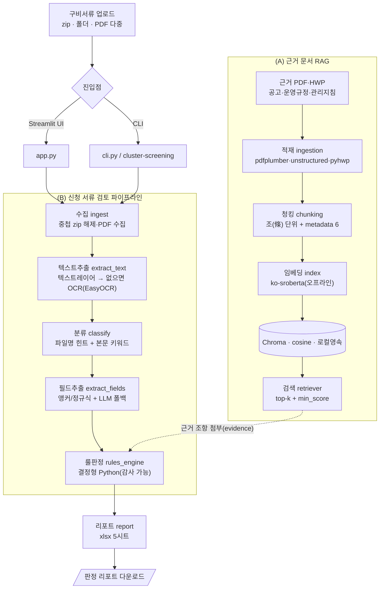

# 입주서류 적합 검토기 (cluster_screening)

기업이 제출한 **구비서류(zip·PDF)** 를 넣으면 **수집 → 분류 → 텍스트추출 → 필드추출 → 룰 판정 → 리포트**
까지 한 번에 처리하고, 모집공고·운영규정·관리지침을 **RAG로 검색해 판정마다 "근거 조항"을 붙인**
**감사 가능한 판정 리포트(xlsx)** 를 만드는 도구입니다. (창업·벤처 녹색융합클러스터 입주 신청서류 적합 검토 자동화)


> 프로젝트 지침: [CLAUDE.md](CLAUDE.md) · 로드맵/진행현황: [NEXTSESSION.md](NEXTSESSION.md) · 폐쇄망 배포: [deploy/OFFLINE.md](deploy/OFFLINE.md)

---

## 아키텍처

성격이 다른 **두 갈래**로 구성됩니다. (A) 근거 문서를 검색하는 RAG, (B) 신청 서류를 판정하는 파이프라인.



### 흐름 한눈에 보기 (처음 보는 분께)

심사관이 손으로 하던 **입주 신청서류 검토**를, 근거를 남기며 자동으로 보조하는 도구입니다.

1. **업로드** — 기업이 낸 구비서류(zip/PDF)를 넣습니다. 중첩 zip·비밀번호도 풉니다.
2. **분류·추출** — 각 서류가 무엇인지(사업자등록증·납세증명서…) 분류하고, 텍스트를 뽑습니다. 스캔본은 OCR로 읽습니다.
3. **판정** — 창업 7년 이내·체납 여부·서류 일치·필수서류 완비 등을 **결정형 규칙**으로 판정합니다.
4. **근거 붙이기** — 각 판정의 **근거 조항**(예: "모집공고 제9조")을 RAG로 찾아 결과에 붙입니다.
5. **리포트** — 종합판정·판단기준별·가점·성과·처리내역을 담은 **xlsx**를 내려받습니다.

> **핵심 원칙**: 못 읽거나 애매하면 **거절하지 않고 `확인필요`** 로 사람에게 넘깁니다(자동 거절 금지).
> 최종 판정은 LLM이 아니라 **사람이 읽고 감사할 수 있는 Python 규칙**이 내립니다.

## 판정 체계

| 판정값 | 의미 |
|---|---|
| **적합** | 요건 충족이 근거와 함께 확인됨 |
| **부적합** | 요건 미충족이 근거와 함께 확인됨 |
| **확인필요** | 추출 신뢰도 낮음·스캔 미해독 → 사람 확인 |
| **해당없음** | 해당 기업/서류에 적용되지 않는 항목 |

종합판정 = 하나라도 `부적합`이면 부적합 / 없고 `확인필요` 있으면 확인필요 / 모두 통과면 적합.

## 판단기준 ↔ 코드

`rules.yaml`의 각 기준 `check` 값은 `pipeline/rules_engine.py`의 **동명 함수와 1:1**(감사 가능).

| 기준 | check 함수 | 핵심 |
|---|---|---|
| 창업 7년 이내 | `check_business_age` | 법인=등기부 회사성립연월일(없으면 개업연월일 폴백)/개인=개업연월일, **달력 7주년** 비교 |
| 벤처기업 자격 | `check_venture` | 벤처기업확인서 제출 여부 |
| 국세·지방세 체납 | `check_tax_arrears` | 납세증명서 체납상태 |
| 허위·부정(일치) | `check_consistency` | 신뢰서류 간 사업자번호(불일치=부적합)·상호/대표자(불일치=확인필요) |
| 필수서류 완비 | `check_completeness` | 9종(법인=등기부·주주명부 포함) 조건부 |
| 가점/감점 | `evaluate_bonus` | 증빙 존재 시 잠정 점수, 합산 ≤5점 |
| 성과 년도별 | `evaluate_performance` | 건수 자동집계, 연도별 금액·인원은 `확인필요` |

## RAG 단계별 구현 현황

우리 RAG는 답변 생성이 아니라 **판정의 근거 조항을 찾아 붙이는 retrieval 중심**입니다(생성은 설계상 부재).

| 단계 | 상태 | 구현 / 한계 |
|---|---|---|
| Data Load(적재) | 🟢 구현 | `data/reference/`의 PDF·HWP 수집 / URL·DB 로더 없음 |
| Parsing(추출) | 🟡 부분 | pdfplumber·unstructured·**pyhwp(HWP)** / 스캔 PDF OCR 미연결, HWP page=1 |
| Chunking | 🟢 구현 | **조(條) 단위 분할** + metadata 6항목 + 제N조 태깅 / 문자 기준(토큰 아님) |
| Embedding | 🟢 구현 | **오프라인** ko-sroberta, 정규화 / 단일 모델, 품질평가 없음 |
| Vector DB | 🟢 구현 | 로컬 **Chroma**(cosine·영속) / 매번 전체 재구축, 증분 없음 |
| Retrieval | 🟢 기본 | top-k + **min_score 필터** + `evidence_for` / rerank·hybrid·query rewriting 없음 |
| 판정 통합 | 🟢 구현 | 기준별 근거 조항 evidence 첨부, RAG OFF 시 우아한 degradation |
| Generation(LLM) | ⚪ 부재 | 판정은 결정형 Python(감사 가능) — 의도적으로 LLM 생성 없음 |
| Evaluation | 🔴 미구현 | 정답셋(질문→근거조항)·recall@k 등 지표 없음 |
| Retrieval 고도화 | 🔴 미구현 | 전략 비교(rerank/hybrid 등) 없음 |

> metadata 6항목 = `source · page · parser_type · chunk_id · token_count · warning` (+ `article`).

## 기능 모듈

화면(`app.py`)은 얇은 진입점, 로직은 `pipeline/`(판정)과 `rag/`(근거 검색)로 분리합니다.

| 모듈 | 역할 |
|---|---|
| `pipeline/ingest.py` | 수집 — (중첩) zip 해제·PDF 수집 (pyzipper AES, basename으로 zip-slip 차단) |
| `pipeline/classify.py` | 분류 — 파일명 힌트(가중치 20) + 본문 키워드 |
| `pipeline/extract_text.py` | 추출 — 텍스트레이어(pdfplumber) → 부족하면 OCR(EasyOCR, tesseract 폴백) |
| `pipeline/extract_fields.py` | 필드추출 — 앵커/정규식(공백 허용 라벨) + LLM 폴백 |
| `pipeline/rules_engine.py` | 룰 판정 + 가점 + 성과 + 종합판정 + RAG 근거 첨부 |
| `pipeline/report.py` | xlsx 리포트(종합판정/판단기준별/가점/성과/처리내역 5시트) |
| `rag/ingestion.py` | 근거 적재 — PDF·HWP 페이지 단위 추출 |
| `rag/chunking.py` | 조(條) 단위 청킹 + metadata 6항목 |
| `rag/index.py` | 임베딩(ko-sroberta) → Chroma 인덱스 |
| `rag/retriever.py` | top-k 검색 + `evidence_for` |
| `rag/cli.py` | `rag-index` / `rag-search` 콘솔 |

## 핵심 설정 (환경변수 · `.env`)

`.env.example`을 복사해 채웁니다. OCR/LLM이 없어도 동작합니다(스캔본은 `확인필요`).

| 항목 | 기본값 | 위치/설명 |
|---|---|---|
| `OPENAI_API_KEY` | (없음) | 설정 시 LLM 필드추출 폴백 ON |
| `LLM_MODEL` | `gpt-4.1-mini` | 텍스트 필드추출 워크호스 |
| `ENABLE_OCR` / `OCR_ENGINE` | `1` / `easyocr` | 스캔 PDF OCR(easyocr·tesseract) |
| `RAG_EMBED_MODEL` | `jhgan/ko-sroberta-multitask` | RAG 임베딩(로컬 경로 지정 시 오프라인) |
| `ENABLE_RAG_BASIS` / `RAG_MIN_SCORE` | `1` / `0.3` | 판정에 근거 조항 첨부 + 노이즈 필터 |
| `USE_UNSTRUCTURED` | `0` | RAG 적재에 unstructured 사용 |
| `ZIP_PASSWORD` | (없음) | 구비서류 zip 비밀번호(`.env` 또는 UI/CLI `--pw`로 입력, 하드코딩 금지) |

## 시작하기

### 1. 설치 (uv)
```bash
uv sync                                   # 기본
uv sync --extra rag --extra unstructured  # RAG(임베딩·Chroma·HWP) + unstructured
```

### 2. 환경변수
```bash
cp .env.example .env        # PowerShell: Copy-Item .env.example .env
# 필요 시 OPENAI_API_KEY 등 입력 (없어도 동작)
```

### 3. 실행
```bash
# Streamlit UI (단독 사용 도구 — 로그인 없음)
uv run streamlit run src/cluster_screening/app.py

# CLI
uv run cluster-screening <zip|폴더|pdf> --name 기업명 --apply 2026-03-16 --pw "<zip비밀번호>" --out 결과.xlsx

# 근거 문서 RAG (data/reference/ 에 공고·규정·지침 PDF·HWP 투입 후)
uv run rag-index
uv run rag-search "국세·지방세 체납 기업 제외"
```

UI에서: 사이드바에 기업명·신청일·zip비번 입력 → 구비서류 업로드 → **검토 실행** → 결과 확인 + 리포트 다운로드.
사이드바 **📚 근거 검색(RAG)** 에서 조항을 직접 검색할 수도 있습니다.

## 폐쇄망(오프라인) 배포

인터넷 PC에서 번들(의존성 wheel + 임베딩·OCR 모델 + NLTK)을 만들어 옮긴 뒤 오프라인 설치합니다.
절차·스크립트는 **[deploy/OFFLINE.md](deploy/OFFLINE.md)**.
```powershell
.\deploy\prepare_offline_bundle.ps1   # 인터넷 PC: 번들 생성
.\deploy\install_offline.ps1          # 폐쇄망: 오프라인 설치
```

## 보안 / Git 관리

- 비밀값(API Key·zip 비번)은 **`.env`에서만** 읽습니다(코드 하드코딩 금지).
- `.env`·`data/`·`chroma/`·`outputs/`·`*.xlsx`·`deploy/bundle/` 는 `.gitignore` 제외.
- 신청 서류 PII: 처리 후 임시폴더는 `pipeline.cleanup`으로 삭제. zip 해제는 basename으로 경로탈출 차단.
- 단독 사용 도구라 앱 로그인은 없음(접근 제어는 외부 리버스 프록시 등에서).

## 프로젝트 구조

```
프로젝트루트/
├── pyproject.toml  uv.lock  .python-version   # uv 패키징
├── .env                                       # 비밀(git 비추적)
├── README.md  CLAUDE.md  NEXTSESSION.md
├── src/cluster_screening/
│   ├── app.py             # Streamlit UI (얇은 진입점)
│   ├── cli.py             # CLI / 콘솔 스크립트 cluster-screening
│   ├── config.py          # 설정 토글(.env/환경변수)
│   ├── rules.yaml         # 판단기준 규칙표
│   ├── pipeline/          # (B) 신청 서류 검토 (위 6모듈)
│   └── rag/               # (A) 근거 문서 RAG (ingestion·chunking·index·retriever·cli)
├── tests/                 # pytest (룰엔진·청킹·파이프라인)
├── deploy/                # 폐쇄망 배포(OFFLINE.md·번들 스크립트)
├── data/reference/        # 근거 PDF·HWP 투입 (git 제외)
└── chroma/                # RAG 벡터 인덱스 (git 제외)
```

## 품질 (테스트·린트)

```bash
uv run pytest        # 룰엔진·청킹·파이프라인 회귀 (37 케이스)
uv run ruff check .  # 정적검사
```

## 다음 단계 (미구현)

진행현황·할 일은 **[NEXTSESSION.md](NEXTSESSION.md)**. 주요 미구현:

- **RAG**: 스캔 근거문서 OCR, 검색 고도화(rerank/hybrid), **정량 평가셋**(질문→근거조항 recall@k)
- **성과 정밀추출**: 재무제표 연도별 매출·영업이익, 명부 인원 추출(현재 건수만 자동집계)
- **녹색산업 분야 적합성** 판정, 가점 유효기간·건수 실검증, 여러 기업 일괄 처리, 연장평가 모드
- PII 마스킹·암호화, mypy·CI, 폐쇄망 실번들 빌드 검증
