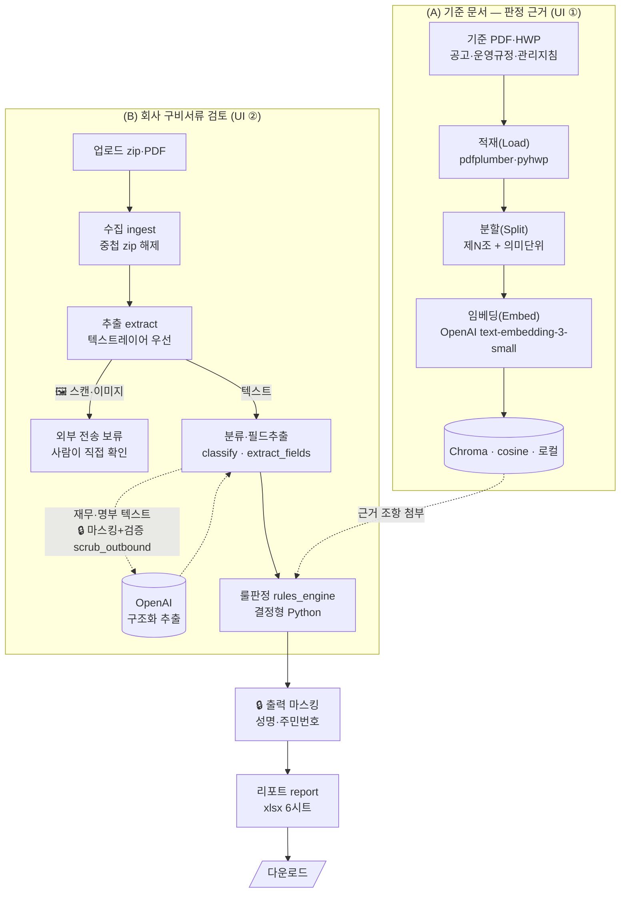

# 녹색융합클러스터 입주기업 신청서류 적합성 검토 및 성과 정리 자동화 (cluster_screening)

기업이 제출한 **구비서류(zip·PDF)** 를 넣으면 **수집 → 분류 → 텍스트추출 → 필드추출 → 룰 판정 → 리포트**
까지 처리하고, 공고·운영규정·관리지침을 **RAG로 검색해 판정마다 "근거 조항"을 붙인**
**감사 가능한 판정 리포트(xlsx)** 를 만드는 도구입니다.


> 프로젝트 지침: [CLAUDE.md](CLAUDE.md) · 작업 현황/할 일: [NEXTSESSION.md](NEXTSESSION.md)

---

## 아키텍처

(A) 기준 문서를 RAG로 인덱싱하고, (B) 회사 서류를 판정하며 (A)의 근거 조항을 붙입니다.



### 흐름 한눈에 보기
1. **① 기준 문서 업로드** → 적재→분할→임베딩→인덱싱(각 단계 결과 확인) → "이 기준으로 판정합니다"(판단기준+가점)
2. **② 회사 구비서류 업로드** → (암호 zip이면 비번 요청) → 검토 → 판정 + **근거 조항** + 가점 + 리포트
3. 못 읽거나 애매하면 **거절하지 않고 `확인필요`** 로 사람에게 넘김. 못 불러온 파일은 **알림**으로 표시.
4. **개인정보는 외부 AI 전송 전 마스킹·검증**하고, 마스킹이 어려운 **이미지·스캔은 전송 보류(사람 확인)**. 결과·리포트는 **출력 마스킹**. → [개인정보 보호](#개인정보-보호-pii-마스킹)

## 판정 체계

| 값 | 의미 |
|----|------|
| **적합 / 부적합** | 요건 충족/미충족이 근거와 함께 확인 |
| **확인필요** | 추출 신뢰도 낮음·스캔 미해독 → 사람 확인 |
| **해당없음** | 적용되지 않는 항목 |

종합판정: 하나라도 `부적합`→부적합 / `확인필요` 있으면 확인필요 / 모두 통과면 적합. 최종 판정은 LLM이 아니라 **감사 가능한 Python 규칙**.

## 개인정보 보호 (PII 마스킹)

개인정보는 **여러 지점에서 최소 노출** 원칙(하이브리드)으로 처리합니다. 운영 정책:
① 개인정보 포함 문서는 먼저 마스킹, ② 마스킹이 어려운 이미지 기반 문서는 사람이 직접 확인, ③ 외부 AI엔 마스킹본·최소정보만 전달.

- **분석(외부 전송) 전 마스킹 + 검증** — 재무제표·명부 등 외부 AI로 보내는 텍스트는 전송 직전
  `masking.scrub_outbound`가 주민·법인번호·전화·이메일을 마스킹하고 **잔여 PII 0건인지 검증**해 감사 로그를 남깁니다.
  판정에 필요한 숫자(매출·연번)는 보존됩니다.
- **이미지·스캔 문서는 외부 전송 보류** — 마스킹이 어려운 이미지 기반 문서는 외부 AI(Vision OCR)로 자동 전송하지
  않고 **"개인정보 포함 가능성 — 사람이 직접 확인"** 으로 알립니다(`AUTO_EXTERNAL_OCR=1`로 옵트인). 로컬 OCR은 정책과 무관.
- **출력 마스킹** — 결과·리포트의 성명은 `홍○○`, 주민·법인번호는 앞 6자리만 남깁니다(사업자번호는 식별자라 유지).
  식별정보(사업자번호·대표자·상호)는 원본으로 판정한 뒤 출력에서만 마스킹.
- Streamlit에 **"개인정보 마스킹 실시 완료"** 배너 + 단계별 검증표 표시. `ENABLE_PII_MASKING`으로 토글.

## 판단기준 ↔ 코드

`rules.yaml`의 `check` 값 ↔ `pipeline/rules_engine.py` 동명 함수(1:1).

| 기준 | 함수 / 핵심 |
|---|---|
| 창업 7년 이내 | `check_business_age` — 법인 등기부 회사성립연월일(없으면 개업연월일), **달력 7주년** 비교 |
| 벤처기업 자격 | `check_venture` |
| 국세·지방세 체납 | `check_tax_arrears` |
| 허위·부정(일치) | `check_consistency` — 사업자번호 불일치=부적합 / 상호·대표자=확인필요 |
| 필수서류 완비 | `check_completeness` — 9종(법인=등기부·주주명부 포함) 조건부 |
| 가점 | `evaluate_bonus` — **건당=점수×건수**, 정액 1회, 감점(국가R&D 제재)=확인필요, 합산 ≤5점 |
| 성과 년도별 | `evaluate_performance` — 건수 자동집계, 금액·인원은 확인필요 |

## RAG 단계별 구현 현황

| 단계 | 상태 | 비고 |
|---|---|---|
| 적재(Load) | 🟢 | PDF·HWP / 스캔 근거문서 OCR은 미연결 |
| 분할(Split) | 🟢 | 제N조 + **의미단위(항·호·목·문장)** 묶음 |
| 임베딩(Embed) | 🟢 | **OpenAI text-embedding-3-small**(offline 폴백 가능) |
| 벡터DB(Index) | 🟢 | 로컬 Chroma(cosine·영속) |
| 검색(Retrieval) | 🟢 | top-k + min_score / rerank·hybrid 미구현 |
| 판정 통합 | 🟢 | 근거 조항 evidence 첨부 |
| 평가(Eval) | 🔴 | 정량 평가셋 없음 |
| 생성(LLM 답변) | ⚪ | 설계상 부재(결정형 판정) |

## 기능 모듈

| 모듈 | 역할 |
|---|---|
| `app.py` / `run.py` | Streamlit UI / protobuf-safe 런처(`cluster-app`) |
| `cli.py` | CLI (`cluster-screening`) |
| `pipeline/ingest.py` | (중첩) zip 해제·PDF 수집(zip-slip 차단) |
| `pipeline/extract_text.py` | 텍스트레이어(pdfplumber) → OCR(**OpenAI Vision** 기본). **스캔·이미지는 외부 전송 보류**(사람 확인) |
| `pipeline/extract_llm.py` | 재무제표·명부 구조화 추출(OpenAI). 전송 전 `scrub_outbound`로 **마스킹+PII 검증** |
| `pipeline/masking.py` | **개인정보(PII) 마스킹** — 외부 전송 전 검증(`scrub_outbound`)·출력 마스킹·감사기록 |
| `pipeline/extract_cache.py` | **내용해시 캐시**(재처리 시 OCR 생략) |
| `pipeline/classify.py` · `extract_fields.py` | 분류 / 앵커·정규식 필드추출 |
| `pipeline/rules_engine.py` | 룰 판정 + 가점 + 성과 + RAG 근거 첨부 |
| `pipeline/report.py` | xlsx 리포트(6시트, 서류 처리내역에 **직접확인 사유** 포함) |
| `rag/ingestion·chunking·index·retriever·cli` | 근거 문서 RAG |

## 핵심 설정 (`.env`)

| 항목 | 기본값 | 설명 |
|---|---|---|
| `OPENAI_API_KEY` | (없음) | RAG 임베딩(OpenAI). 없으면 임베딩 offline 모드 |
| `RAG_EMBED_PROVIDER` | `openai`(키 있으면)/`offline` | 임베딩 제공자 |
| `RAG_MIN_SCORE` / `ENABLE_RAG_BASIS` | `0.3` / `1` | 근거 조항 첨부 + 노이즈 필터 |
| `OCR_ENGINE` | `openai` | OCR 엔진(openai Vision / easyocr / tesseract) |
| `AUTO_EXTERNAL_OCR` | `0` | 이미지·스캔을 외부 Vision OCR로 자동 전송(기본 **보류**, 사람 확인) |
| `ENABLE_PII_MASKING` | `1` | 개인정보 마스킹(외부 전송 전 + 출력) on/off |
| `OCR_DPI` / `OCR_MAX_PAGES` | `200` / `3` | OCR 해상도 / 앞 N페이지만 |
| `ENABLE_EXTRACT_CACHE` / `EXTRACT_WORKERS` | `1` / `4` | 추출 캐시 / 파일 병렬 수 |
| `ZIP_PASSWORD` | (없음) | zip 비번(UI/CLI 입력 가능, 하드코딩 금지) |

## 시작하기

```bash
uv sync --extra rag --extra unstructured   # 의존성(임베딩·Chroma·HWP·unstructured)
cp .env.example .env                        # OPENAI_API_KEY 입력(임베딩용)

uv run cluster-app                          # UI (protobuf-safe 런처) → http://localhost:8501
uv run cluster-screening <zip|폴더|pdf> --name 기업명 --apply 2026-03-16 --pw "<zip비번>"   # CLI
uv run rag-index ; uv run rag-search "체납 기업 제외"   # RAG 콘솔(선택)
```
> UI는 `streamlit run`이 아니라 **`uv run cluster-app`** 으로 띄우세요(인덱싱 단계 protobuf 충돌 회피).

## 성능

- 필드 불필요 유형(사업계획서·주주명부·동의서·명부)은 **파일명으로 식별 시 OCR 생략**
- OCR **앞 3페이지·200DPI**, **내용해시 캐시**(재실행 즉시), **파일 단위 병렬 추출**
- 처리 중 **단계별 로그** + 파일별 **불러오기 상태(O/X)**·실패 알림

## 보안 / Git

- 비밀값은 `.env`에서만(하드코딩 금지). `.env`·`data/`·`chroma/`·`.extract_cache/`·`*.xlsx`는 `.gitignore`.
- 신청 서류 PII: **외부 AI 전송 전 마스킹·검증**, **이미지·스캔은 전송 보류(사람 확인)**, **출력 마스킹**(→ [개인정보 보호](#개인정보-보호-pii-마스킹)).
  처리 후 임시폴더 즉시 삭제, zip 해제 시 경로탈출 차단. 단독 사용 도구라 앱 로그인 없음.

## 프로젝트 구조

```
프로젝트루트/
├── pyproject.toml  uv.lock  .python-version  .streamlit/config.toml
├── .env                      # 비밀(git 비추적)
├── README.md  CLAUDE.md  NEXTSESSION.md
├── src/cluster_screening/
│   ├── app.py  run.py  cli.py  config.py  rules.yaml
│   ├── pipeline/            # 수집·추출·캐시·분류·필드·룰판정·리포트
│   └── rag/                 # 근거 문서 RAG
├── tests/                   # pytest(룰엔진·청킹·캐시·파이프라인)
├── data/reference/          # 기준 PDF·HWP (git 제외)
└── chroma/                  # RAG 벡터 인덱스 (git 제외)
```

## 품질 / 다음 단계

```bash
uv run pytest        # 54 케이스
uv run ruff check .  # 정적검사
```
진행 현황·할 일은 **[NEXTSESSION.md](NEXTSESSION.md)**. (폐쇄망 배포는 일단 보류 — 추후 재구성)
